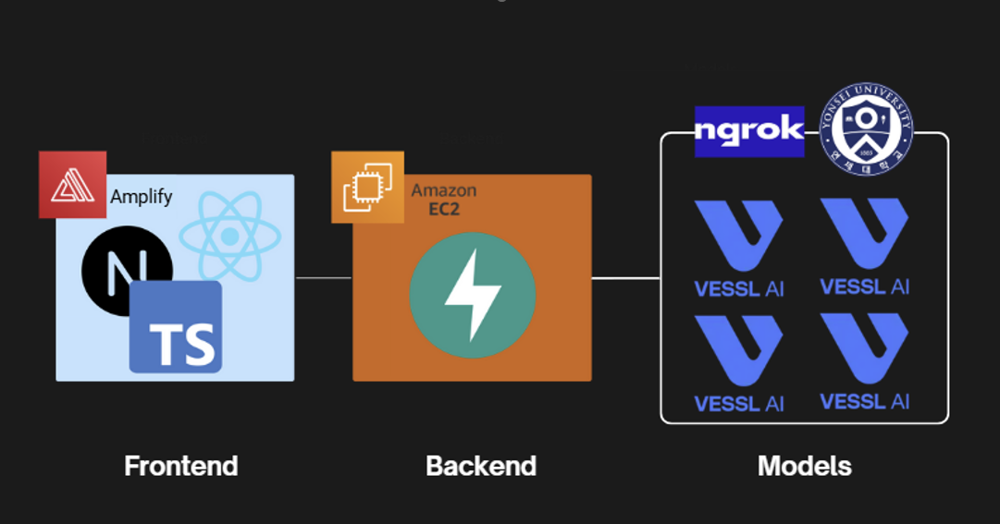

# Fakebusters

<div align="center">
<h3>24-2 YBIGTA 컨퍼런스</h3>
<em>딥페이크 탐지 모델</em>
</div>


## 📌 프로젝트 개요

**FakeBusters**는 영상 내 위조 여부를 탐지하는 딥페이크 탐지 서비스입니다. 본 서비스는 **프론트엔드, 백엔드, 그리고 4개의 모델 서버**로 구성되어 있으며, 다양한 알고리즘을 활용해 딥페이크를 탐지합니다.

## 🏗️ 시스템 아키텍처

모델들은 독립적인 서버로 실행되며, 백엔드에서 요청을 받아 탐지 결과를 반환합니다.


---

### 🔧 백엔드 (Backend)
- **FastAPI** 기반 REST API 서버.
- 4개의 모델 서버와 연동하여 탐지 결과를 관리.

### 🖥️ 프론트엔드 (Frontend)
- **React.js + Next.js** 기반 웹 애플리케이션.
- AWS Amplify 배포 및 HTTPS 도메인 설정.
- UI/UX 최적화 (영상 업로드, 로딩 화면, 탐지 결과 시각화).

### 🏗️ 모델 서버 (Model Inference Servers)
- **FakeCatcher CNN/SVR, LipForensics, MMDet**의 모델이 각각 독립 서버로 동작.
- 각 모델별 세부 인퍼런스 방법은 각 모델 디렉토리 내 `README.md`에 포함됨.

---

## 🚀 설치 및 실행 방법

### 1️⃣ 프로젝트 클론 및 의존성 설치
```bash
git clone https://github.com/YBIGTA/25th-conference-fakebusters.git
cd 25th-conference-fakebusters
```

### 2️⃣ 각 서버 환경 설정
```bash
. ./setup.sh -m 'model명' -c 'config.yaml 상대경로'  #각 모델 별 환경설정
. ./setup.sh                                      #전체 환경 설정
```

### 3️⃣ 개별 서버 실행
각 서버는 독립적으로 실행 가능하며, 세부 실행 방법은 해당 디렉토리의 `README.md`를 참고하세요.


## 📊 탐지 모델 개요

| 모델명          | 주요 탐지 방식                      | 사용된 기술/알고리즘                     | 주요 특징                                      |
|---------------|---------------------------------|--------------------------------|--------------------------------------|
| **FakeCatcher CNN** | PPG-MAP 기반 CNN 분류기  | Dlib, MediaPipe, CNN, Random Forest | 생체 신호 기반 탐지, 얼굴 영역 중심 분석 |
| **LipForensics** | 입술 움직임 패턴 탐지          | ResNet-18, MSTCN                  | 시공간적 움직임 분석, 다양한 위조 방식에 강건 |
| **MMDet**       | 이미지 주파수 도메인 분석        | CLIP Encoder, DIRE, VQ-VAE, LLaVa         | 멀티모달 모델을 이용한 GAN 및 Diffusion 이미지 생성 방식 탐지 |
| **FakeCatcher SVR** | PPG 기반 SVR 분류기 | Signal Processing, Support Vector Regression | 생체 신호 기반 탐지, SVR 모델 활용 |


---

## 📜 라이선스
본 프로젝트는 MIT 라이선스를 따릅니다. 자유롭게 수정 및 배포할 수 있습니다.

## 📢 팀 구성
| 이름  | 역할  |
|------|------|
| 박동연 | DS (FakeCatcher 모델링) |
| 이동렬 | DS (MM-Det 모델링) |
| 정회수 | DA (데이터 전처리) |
| 양인혜 | DS (LipForensics 모델링) |
| 임채림 | DE (백엔드 개발) |
| 성현준 | DE (프론트엔드 개발) |
| 정다연 | DS (FakeCatcher 모델링) |

---

- **문의**: `2019147559@yonsei.ac.kr`

---

FakeBusters - 딥페이크 탐지의 새로운 기준 🚀
